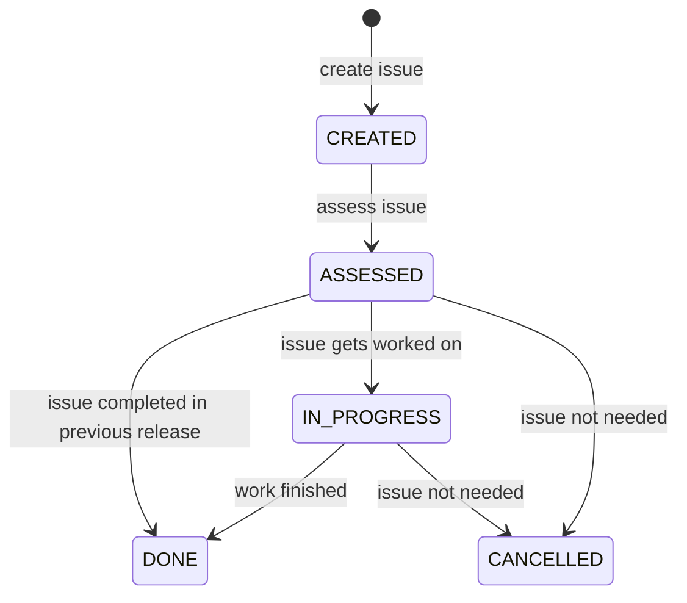

A user first creates an issue for a feature addition 
or a bug fix. This issue is now in CREATED and 
awaits the analysis of another developer who will 
determine if the issue is feasible. Once the developer 
has determined whether the issue can be completed,
the issue is now in ASSESSED and can either move to 
DONE or TODO. If the client uses an old version of the 
software and the issue they are addressing has already 
been fixed in a newer version, the issue is then moved to
DONE. If the issue will be worked on, then it is moved
to TODO. 

However, the scope of the issue may be too large and 
may require it to be broken up into more manageable issues.
In this case, the issue will be moved back into ASSESSED
and be divided into different issues of the same complexity.
These smaller issues will then be moved back into 
TODO.

When a developer begins to work on an issue,
the issue moves into IN_PROGRESS. If there are a deluge of
issues deemed to be more important than the current issue a 
developer is working on, the issue may get moved back 
into TODO until it gets picked up by another developer.

When the developer has finished working on an issue, the 
issue will be moved to REVIEW and another developer will 
review the work they have done. If the reviewer approves 
what the developer has done, the issue will be marked as
done and moved to DONE. If not, the developer will revise 
their work and have it reviewed again until the issue is
approved by a reviewer.

In addition to the cases listed above, there is  
another case that could occur when an issue is in 
ASSESSED. If the issue describes an old issue which 
appeared on a previous version of the system but has 
been fixed on the subsequent newer versions, the 
issue will be moved to DONE.

Furthermore, for states in ASSESSED, TODO, IN_PROGRESS, 
and REVIEW, the user can update the issue without moving the
issue into a new state. 

Lastly, at any point for an issue in ASSESSED, TODO,
IN_PROGRESS, and REVIEW, it can be moved into CANCELLED 
since the issue may not be needed any further.
