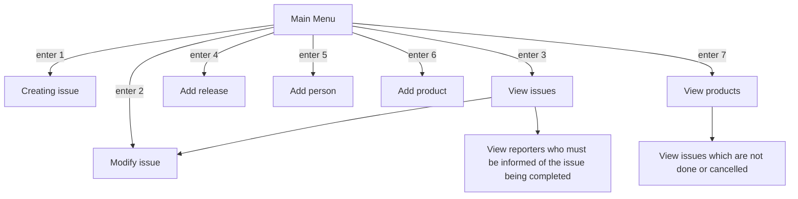

Creating and modifying an issue seems to have a similar structure.
Maybe 



Maybe for the requirement of viewing issues which have not been 
cancelled or finished, we can add a `View products` option to 
our main menu where the user can pick to have that info listed to 
them?

# Creating an issue

```Welcome!
  To get started select one of the numbers associated with the options below
  1) Create issue
  2) Modify issue
  3) View issues
  4) Add release
  5) Add reporter
  6) Add product
  7) View products
  [user response]
  ```

## 7 is inputted

```Welcome!
To get started select one of the numbers associated with the options below
1) Create issue
2) Modify issue
3) View issues
4) Add release
5) Add reporter
6) Add product
7) View products
7
  
Select the number associated to the product you are interested in  
1) Product A
2) Product B
3) Product C
4) Product D
5) Product E
....
20) Product T
Press n to view the next twenty records, and q to return to the main menu
[user input]
  ```

### User selects product A
```
To get started select one of the numbers associated with the options below
1) Create issue
2) Modify issue
3) View issues
4) Add release
5) Add reporter
6) Add product
7) View products
7

Select the number associated to the product you are interested in  
1) Product A
2) Product B
3) Product C
4) Product D
5) Product E
....
20) Product T
Press n to view the next twenty records, and q to return to the main menu
1

Product A
Would you like to view the issues pertaining to this product which 
are not closed nor completed? Enter Y below to see the list and N
to return to the main menu
[user response]
```

### User enters Y


```
To get started select one of the numbers associated with the options below
1) Create issue
2) Modify issue
3) View issues
4) Add release
5) Add reporter
6) Add product
7) View products
7

Select the number associated to the product you are interested in  
1) Product A
2) Product B
3) Product C
4) Product D
5) Product E
....
20) Product T
Press n to view the next twenty records, and q to return to the main menu
1

Product A
Would you like to view the issues pertaining to this product which 
are not closed nor completed? Enter Y below to see the list and N
to return to the main menu
Y

1 0001 Product A Priority: 2 AffRel: 1.0 AntRel: 1.1 Created: 2001/10/21
      - Retain user credentials when the page is refreshed
        
2 0002 Product A Priority: 3 AffRel: 1.1 AntRel: 1.2 Created: 2004/01/10
      - Allow users to sign up using Google
....
20 0020 Product A Priority: 3 AffRel: 1.9 AntRel: 2.0 Created: 2009/01/10
      - Allow users to permanantly delete their account
Enter n to view the next 20 issues, and q to return to the main menu      
```

[//]: # (## 1 is inputted)

[//]: # ()
[//]: # (```)

[//]: # (To get started select one of the numbers associated with the options below)

[//]: # (1&#41; Create issue)

[//]: # (2&#41; Modify issue)

[//]: # (3&#41; View issues)

[//]: # (4&#41; Add release)

[//]: # (5&#41; Add person)

[//]: # (6&#41; Add product)

[//]: # ([user response])

[//]: # ()
[//]: # (Enter the title of the issue:)

[//]: # ([user’s response goes here])

[//]: # (Enter the description of the issue:)

[//]: # ([user response])

[//]: # (Enter the priority of the issue &#40;1 - 5&#41;:)

[//]: # ([user response])

[//]: # (Please enter the number associated to the product you are interested in)

[//]: # (1&#41; product a)

[//]: # (2&#41; product b)

[//]: # (3&#41; product c)

[//]: # (......)

[//]: # (n&#41; product n)

[//]: # ([user response])

[//]: # (Please enter the release where the issue is being made from:)

[//]: # (1&#41; product a)

[//]: # (2&#41; product b)

[//]: # (3&#41; product c)

[//]: # (......)

[//]: # (n&#41; product n)

[//]: # ([user response])

[//]: # (Please enter the name of the reporter of the issue:)

[//]: # (1&#41; name a)

[//]: # (2&#41; name b)

[//]: # (3&#41; name c)

[//]: # (......)

[//]: # (n&#41; name n)

[//]: # ([user response])

[//]: # (```)

[//]: # ()
[//]: # (### All the information is entered)

[//]: # ()
[//]: # (```)

[//]: # (To get started select one of the numbers associated with the options below)

[//]: # (1&#41; Create issue)

[//]: # (2&#41; Modify issue)

[//]: # (3&#41; View issues)

[//]: # (4&#41; Add release)

[//]: # (5&#41; Add person)

[//]: # (6&#41; Add product)

[//]: # ([user response])

[//]: # ()
[//]: # (Enter the title of the issue:)

[//]: # ([user’s response goes here])

[//]: # (Enter the description of the issue:)

[//]: # ([user response])

[//]: # (Enter the priority of the issue &#40;1 - 5&#41;:)

[//]: # ([user response])

[//]: # (Please enter the number associated to the product you are interested in)

[//]: # (1&#41; product a)

[//]: # (2&#41; product b)

[//]: # (3&#41; product c)

[//]: # (......)

[//]: # (n&#41; product n)

[//]: # ([user response])

[//]: # (Please enter the release where the issue is being made from:)

[//]: # (1&#41; product a)

[//]: # (2&#41; product b)

[//]: # (3&#41; product c)

[//]: # (......)

[//]: # (n&#41; product n)

[//]: # ([user response])

[//]: # (Please enter the name of the reporter of the issue:)

[//]: # (1&#41; name a)

[//]: # (2&#41; name b)

[//]: # (3&#41; name c)

[//]: # (......)

[//]: # (n&#41; name n)

[//]: # ([user response])

[//]: # ()
[//]: # (The issue with title [title-name] has been created)

[//]: # ()
[//]: # (To get started select one of the numbers associated with the options below)

[//]: # (1&#41; Create issue)

[//]: # (2&#41; Modify issue)

[//]: # (3&#41; View issues)

[//]: # (4&#41; Add release)

[//]: # (5&#41; Add person)

[//]: # (6&#41; Add product)

[//]: # ([user response])

[//]: # ()
[//]: # (```)

[//]: # ()
[//]: # ()
[//]: # ()
[//]: # (## Modifying an issue)

[//]: # ()
[//]: # (```)

[//]: # (Please select and enter the number associated to the change you want to make)

[//]: # (1&#41; Edit title)

[//]: # (2&#41; Edit description)

[//]: # (3&#41; Edit priority)

[//]: # (4&#41; Edit anticipated release)

[//]: # (5&#41; Edit product)

[//]: # (6&#41; Edit status)

[//]: # ([user response])

[//]: # (```)

[//]: # ()
[//]: # (### User selects 1)

[//]: # ()
[//]: # (```)

[//]: # (Please input the new title you would like the issue to have:)

[//]: # ([user response])

[//]: # ()
[//]: # (Would you like to make more changes?)

[//]: # (If so, please enter Y below. If not, please enter N to return to the main menu)

[//]: # ([user response])

[//]: # ()
[//]: # (```)

[//]: # ()
[//]: # (## Viewing an issue)

[//]: # ()
[//]: # (```)

[//]: # (Please enter Y if you would like to view issues relating to a specific product, and N otherwise)

[//]: # (```)

[//]: # ()
[//]: # (### User enters Y)

[//]: # ()
[//]: # (```)

[//]: # (Please select the number associated to the product you are interested in)

[//]: # (1&#41; Product a)

[//]: # (2&#41; Product b)

[//]: # (…)

[//]: # (20&#41; product n)

[//]: # ()
[//]: # (Please enter n if you would like to view more products, b if you would like to return to the previous page of products, and q if you would like to return)

[//]: # (```)

[//]: # ()
[//]: # (```)

[//]: # ()
[//]: # (Please enter Y if would like to view issues pertaining to a specific release, and N otherwise)

[//]: # ()
[//]: # (```)
