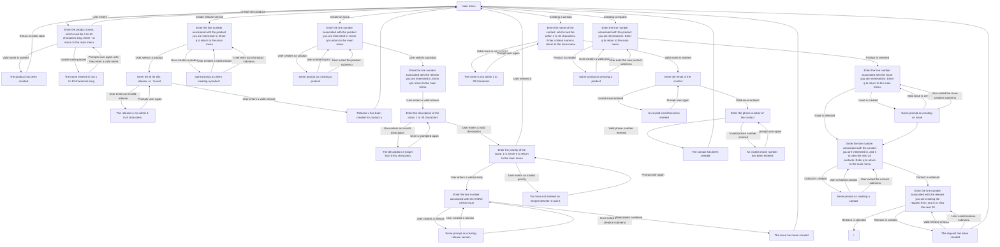

```mermaid
flowchart TD
    A[main menu] --> |Create new product| B
    B[Enter the product name, which must be 1 to 10 characters long. Enter ` to return to the main menu.] --> |Valid name is passed| C[The product has been created.]
    B --> |Invalid name passed| D[The name entered is not 1 to 10 characters long]
    D --> |Prompts user again until they enter a valid name |B
    C --> |Return to initial state|A
    B --> |User enters `| A

    A --> |Create release version| E[Enter the line number associated with the product you are interested in. Enter q to return to the main menu]
    E --> |User selects a product| F[Enter the id for this release, or ` to exit]
    E --> |User creates a product| H[same prompt as when creating a product]
    H --> |User creates a valid product| E
    H --> |User exits out of product submenu| E
    F --> |User enters an invalid release| I[The release is not within 1 to 8 characters.]
    I --> |Prompts user again| F
    F --> |User enters a valid release| G[Release x has been created for product y]
    G --> A

    A --> |Create an issue| J[Enter the line number associated with the product you are interested in. Enter q to return to the main menu]
    J --> |User creates an product| R[Same prompt as creating a product]
    R --> |User created a product| J
    R --> |User exited the product submenu| J
    J --> |User selects a product| K[Enter the line number associated with the release you are interested in. Enter q to return to the main menu]
    K --> |User enters a valid release| L[Enter the description of the issue, 1 to 30 characters ]
    L --> |User enters an invalid description| S[The description is longer than thirty characters.]
    S --> |User is prompted again| L
    L --> |User enters a valid description| M[Enter the priority of the issue, 1-5. Enter 0 to return to the main menu]
    M --> |User enters a valid priority| N[Enter the line number associated with the AntRel of this issue]
    N --> |User creates a release| Q[Same prompt as creating release version]
    Q --> |User created a release| N
    Q --> |User exited the release creation submenu| N
    M --> |User enters an invalid priority |P[You have not entered an integer between 0 and 5]
    P --> |Prompt user again| M
    M --> |User entered 0| A
    N --> |User enters a release| O[The issue has been created]
    O --> A

    A --> |Creating a contact| T[Enter the name of the contact, which must be within 1 to 30 characters. Enter a blank name to return to the main menu]
    T --> |Valid name is entered| U[Enter the email of the contact]
    T --> |Valid name is not entered| X[The name is not within 1 to 30 characters]
    X --> |Prompt user again| T
    U --> |Valid email entered| V[Enter the phone number of the contact]
    U --> |Invalid email entered| Z[An invalid email has been entered]
    Z --> |Prompt user again| U
    V --> |Valid phone number entered| W[The contact has been created]
    V --> |Invalid phone number entered| a[An invalid phone number has been entered]
    a --> |prompt user again| V
    W --> A


    A --> |Creating a request| b[Enter the line number associated with the product you are interested in. Enter q to return to the main menu]
    b --> |Product is selected| c[Enter the line number associated with the issue you are interested in. Enter q to return to the main menu.]
    b --> |Product is created| d[Same prompt as creating a product]
    d --> |User creates a valid product| b
    d --> |User exits the new product submenu| b
    c --> |Issue is selected| e[Enter the line number associated with the contact you are interested in, and n to view the next 20 contacts. Enter q to return to the main menu]
    c --> |Issue is created| f[Same prompt as creating an issue]
    f --> |Valid issue is created| c
    f --> |User exited the issue creation submenu| c
    f --> e
    e --> |Contact is selected| g[Enter the line number associated with the release you are creating the request from, and n to view the next 20]
    e --> |Contact is created| h[Same prompt as creating a contact]
    h --> |User created a contact| e
    h --> |User exited the contact submenu| e
    g --> |Release is selected| i[f]
    g --> |Release is created| j[The request has been created]
    j --> |Valid release created| g
    j --> |User exited release submenu| g
    j --> A

```