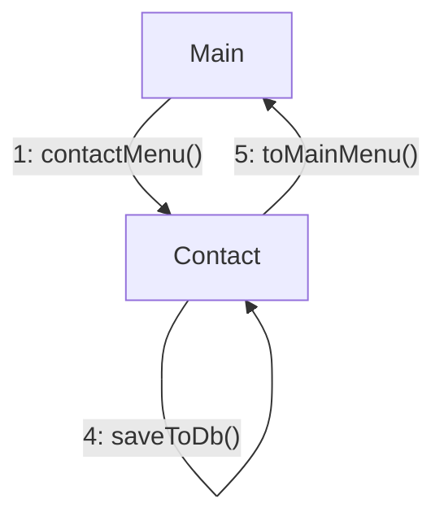

The user enters the contact creation submenu and is asked to input the name, email, and 
phone-number of the contact separately. When entering the name, email, or phone-number, an 
error message will be shown to the user if it does not qualify as valid; the user will 
be prompted again to enter the name, email, or phone-number, depending on what they 
entered which caused the error. Otherwise, a new contact will be created using the entered name,
email, and phone-number. The user will then be returned to the main menu.