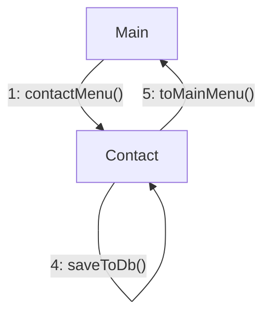

```mermaid
flowchart TD
    A[Main] --> |"1: contactMenu()"| B[Contact]
    B --> |"2: validateContactInformation(contactInfo)"| B    
    B --> |"3: enterContactInformation(name, email, phoneNumber)"| B
    B --> |"4: saveToDb()"| B
    B --> |"5: toMainMenu()"| A

```