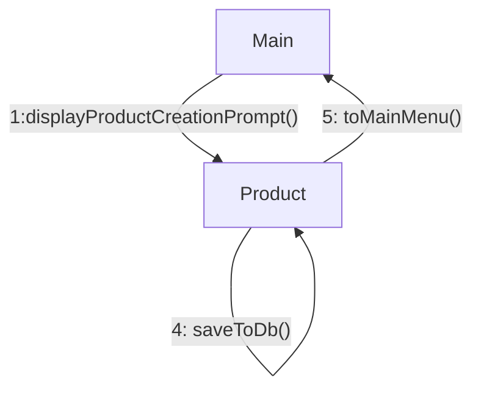

```mermaid
flowchart TD
    A[Main] --> |"1:displayProductCreationPrompt()"| B[Product]
    B --> |"2: validateProductInformation(name)"| B
    B --> |"3: enterProductInformation(name)"| B
    B --> |"4: saveToDb()"| B
    B --> |"5: toMainMenu()"| A
``` 