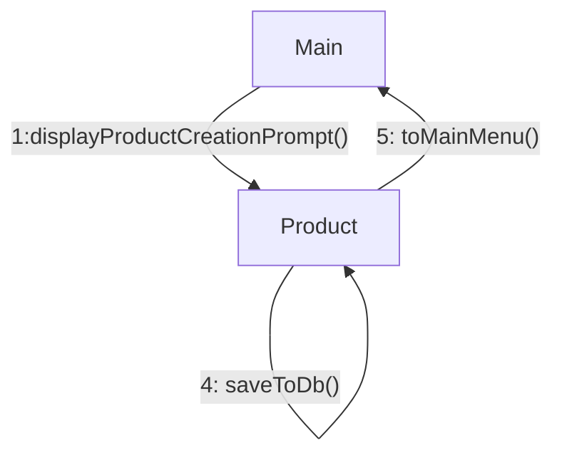

The user enters the product creation submenu and enters the name of a new product.
If the new product name is valid, a product with that same name is created and the 
user is returned to the main menu. Otherwise, the user is shown an error message and 
will be prompted again to enter a product name.