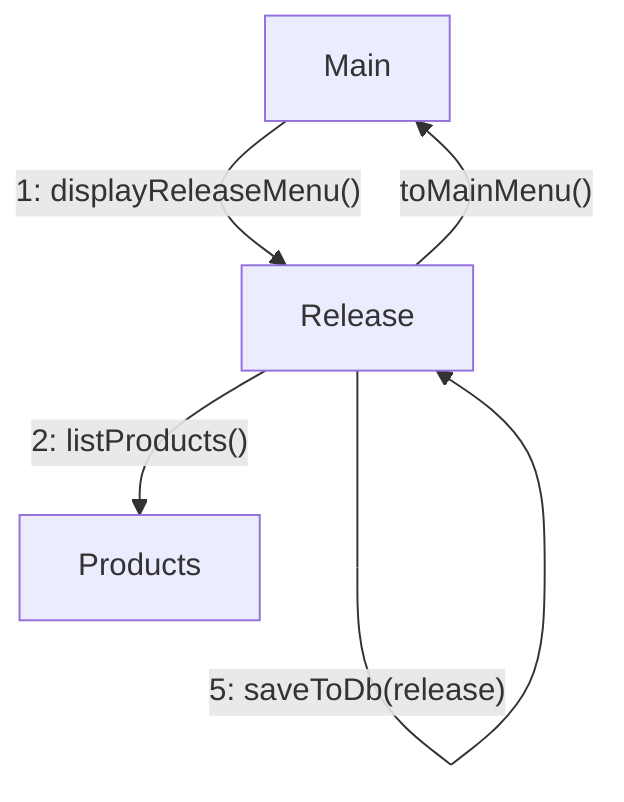

```mermaid
flowchart TD
    A[Main] --> |"1: displayReleaseMenu()"| B[Release]
    B --> |"2: listProducts()"| C[Products]
    B --> |"3: validateReleaseInformation(releaseId)"| B
    B --> |"4: enterReleaseInformation(product, releaseId)"| B
    B --> |"5: saveToDb(release)"| B
    B --> |"toMainMenu()"| A
``` 
