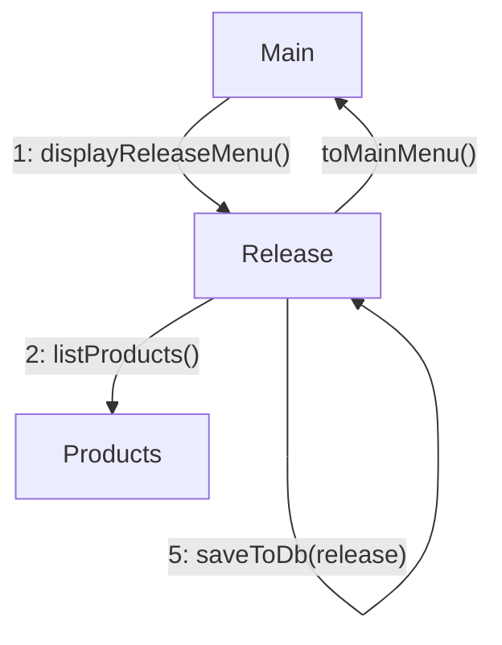

The user enters the release menu and clicks on a product. After, the user is prompted to 
enter the value of the new release id. If the release id is valid, then a new release 
for the selected product will be created and the user will be returned to the main menu. 
Otherwise, the user is shown an error message and are prompted again to enter a release id.