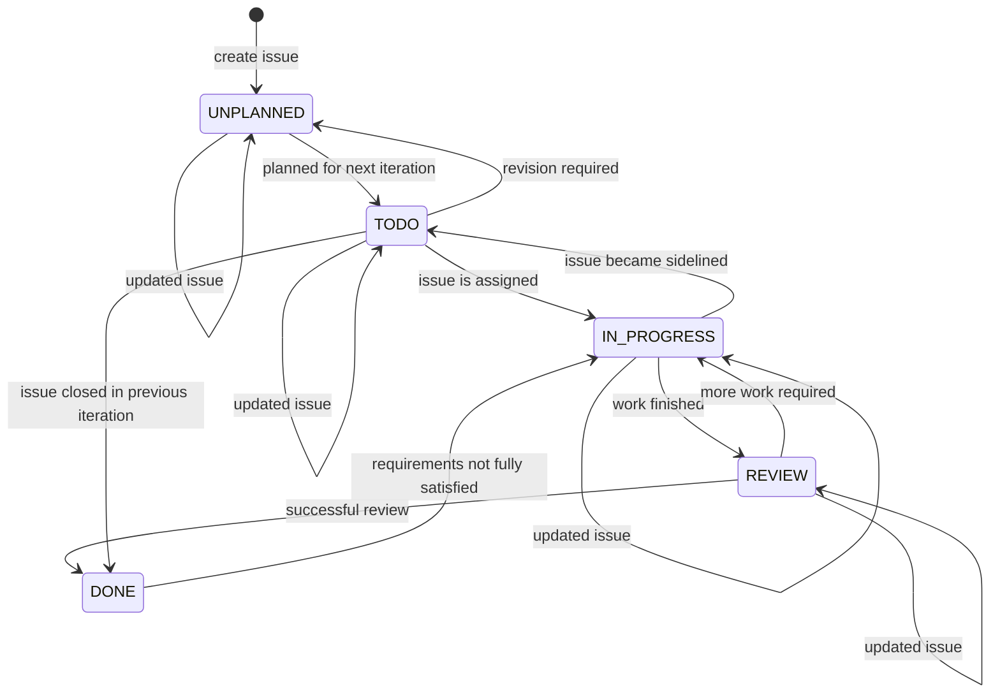

[//]: # (The possible states the issue tracking system has is )

[//]: # (UNPLANNED, TODO, IN_PROGRESS, REVIEW, and DONE.)

[//]: # (An issue in UNPLANNED if it has not been assigned to )

[//]: # (the next iteration, in TODO if it has been assigned to )

[//]: # (an iteration but no one has taken ownership of the issue,)

[//]: # (in IN_PROGRESS if someone is working on the issue, in )

[//]: # (REVIEW if someone is reviewing an issue, and in DONE )

[//]: # (if an issue has been reviewed and approved by the )

[//]: # (reviewer.)

The user first creates an issue, which can be updated 
with additional information about the status, 
release version, priority, and other information.
Once it has been decided that the issue will be worked 
on in the next iteration, it is now in TODO as it is moved 
to the list of issues to work on

However, the scope of the issue may be too large and 
may require it to be broken up into more manageable issues.
In this case, the issue will be moved back into UNPLANNED
and be divided into different issues of the same complexity.
These smaller issues will then be moved back into 
TODO when the time is deemed right.

When a developer is assigned an issue to work on, then
it moves into IN_PROGRESS. If there are a deluge of issues
deemed to be more important than the current issue a 
developer is working on, the issue may get moved back 
into TODO until it gets picked up by another developer

[//]: # (User creates an issue)

[//]: # ()
[//]: # (That issue can be updated before moving it to an iteration)

[//]: # ()
[//]: # (That issue will be unassigned until someone grabs it. However,)

[//]: # (if the issue is vague or large in scope, it can be )

[//]: # (moved back and broken up into more manageable issues before)

[//]: # (being assigned to the next iteration)

[//]: # ()
[//]: # (When a developer is working on an issue, the issue could )

[//]: # (be sidelined by other issues which are deemed to be )

[//]: # (more important, and the issue may be moved back to )

[//]: # (the list of issues to work on)

[//]: # ()
[//]: # (Once a developer finishes working on an issue, it will )

[//]: # (get reviewed by another developer. If the reviewer assesses )

[//]: # (the work done on the issue as incomplete or in need of )

[//]: # (refinement, it will be returned to the original developer )

[//]: # (to let them improve their work.)

[//]: # (If the reviewer approves the work done on the issue, the )

[//]: # (issue will be marked as done)

[//]: # ()
[//]: # (However, the issue may be marked as complete but still has)

[//]: # (not fixed the issue it addresses. In this case, the )

[//]: # (issue will be returned to the list of issues to work on)

[//]: # ()
[//]: # ()
[//]: # (At any point of time when planning out issues, having them )

[//]: # (remained unassigned, working on them, and reviewing them, )

[//]: # (an issue can always be updated to modify its release date,)

[//]: # (severity, )

[//]: # ()
[//]: # ()
[//]: # ()
