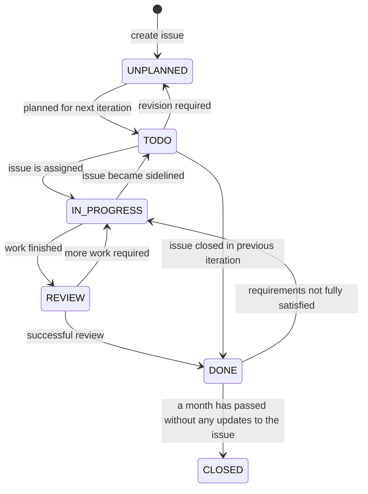

[//]: # (The possible states the issue tracking system has is )

[//]: # (UNPLANNED, TODO, IN_PROGRESS, REVIEW, and DONE.)

[//]: # (An issue in UNPLANNED if it has not been assigned to )

[//]: # (the next iteration, in TODO if it has been assigned to )

[//]: # (an iteration but no one has taken ownership of the issue,)

[//]: # (in IN_PROGRESS if someone is working on the issue, in )

[//]: # (REVIEW if someone is reviewing an issue, and in DONE )

[//]: # (if an issue has been reviewed and approved by the )

[//]: # (reviewer.)

The user first creates an issue, which can be updated 
with additional information about the status, 
release version, priority, and other information.
Once it has been decided that the issue will be worked 
on in the next iteration, it is now in TODO as it is moved 
to the list of issues to work on.

However, the scope of the issue may be too large and 
may require it to be broken up into more manageable issues.
In this case, the issue will be moved back into UNPLANNED
and be divided into different issues of the same complexity.
These smaller issues will then be moved back into 
TODO when the time is deemed right.

When a developer is assigned an issue to work on, then
it moves into IN_PROGRESS. If there are a deluge of issues
deemed to be more important than the current issue a 
developer is working on, the issue may get moved back 
into TODO until it gets picked up by another developer

When the developer has finished working on an issue, 
another developer will review the work they have done. 
If the reviewer approves what the developer has done, the 
issue will be marked as done and moved to DONE. If not,
the developer will revise their work and have it reviewed
again until the issue is approved by a reviewer.

Although an issue may be in DONE, it could be that 
the reviewer missed something. If the problem that the 
issue was intended to fix pops up again, the issue will 
be moved back to IN_PROGRESS in order to fix the issue.
If no changes have occurred to the issue within a month,
then the issue is moved to CLOSED and can not be modified.
If the problem identified by the closed issue appears 
again, the user must create a new issue.

